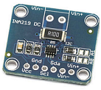

# INA219
TI Bidirectional Current/Power Monitor Sensor Driver for TiJOS

| 条目         | 说明                          |
| ---------- | --------------------------- |
| 驱动名称       | INA219 电流电源监控传感器            |
| 适用         | 该驱动适用于INA219 双向电流／电源监控传感器   |
| 通讯方式       | I2C                         |
| Java Class | TiINA219.java               |
| 图片         |  |

